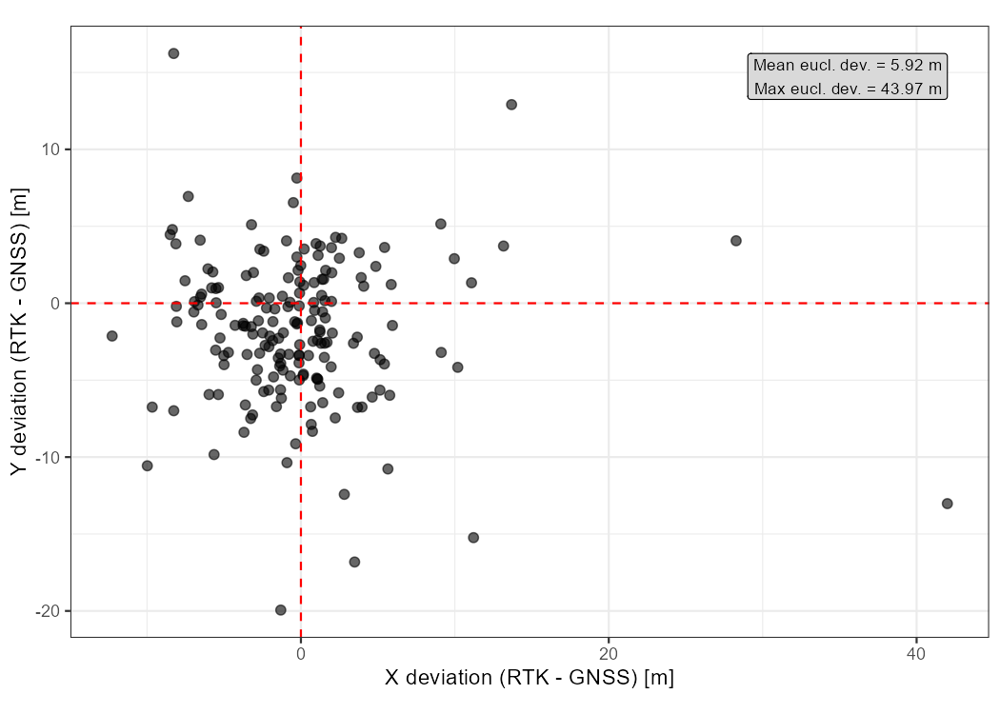

# RTK GNSS vs. non-RTK GNSS 

Assessment of GNSS positioning methods: RTK-corrected vs. standalone for terrestrial sample plot geolocation in forest inventories.

## Background

Terrestrial sample plots in forest inventories are located with Global Navigation Satellite Systems (GNSS). In dense forests, standalone GNSS positioning can be off by several meters because of canopy cover, satellite geometry, and atmospheric effects. Real-Time Kinematic (RTK) correction reduces these errors to the sub-meter range.

Accurate plot positions matter as soon as field data are combined with remote sensing data such as airborne laser scanning (ALS), aerial imagery, or satellite imagery. If the plot location used in the field and the location in the remote sensing data do not match, the two data sources describe slightly different patches of forest. This mismatch (co-registration error) adds uncertainty to any model that links field measurements to remote sensing data.

We quantify how much RTK correction shifts the plot positions and how this affects the agreement between terrestrial and ALS-based heights, using remeasured inventory plots in the Solling region (Lower Saxony, Germany).

The figure below shows for each plot the shift between the original GNSS position and the RTK-corrected position. On average the positions move by about 6 m, with individual shifts of up to ~44 m.

## Full analysis

The analysis is available as a rendered report:
<https://nwfva-b4.github.io/rtk_vs_non_rtk/>
